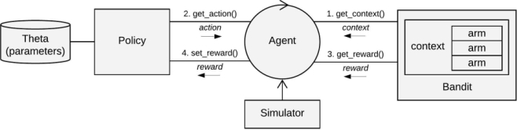

Contextual: Multi-Armed Bandits in R
====================================

[](https://tidyverse.org/lifecycle/#maturing) [](https://ci.appveyor.com/project/robinvanemden/contextual) [](https://travis-ci.org/Nth-iteration-labs/contextual) [](https://codecov.io/gh/Nth-iteration-labs/contextual)[](https://www.gnu.org/licenses/gpl-3.0) [](https://zenodo.org/badge/latestdoi/114037654) [](https://cran.r-project.org/package=contextual) 

<!--
* [AppVeyor: passing](https://ci.appveyor.com/project/robinvanemden/contextual)
* [Travis CI: passing](https://travis-ci.org/Nth-iteration-labs/contextual)
* [Codecov: 96% coverage](https://codecov.io/gh/Nth-iteration-labs/contextual)
-->

Overview
--------

R package facilitating the simulation and evaluation of context-free and contextual Multi-Armed Bandit policies.

The package has been developed to:

* Introduce a wider audience to contextual bandit policies' advanced sequential decision strategies.
* Ease the implementation, evaluation and dissemination of both existing and new contextual Multi-Armed Bandit policies. 

Installation
------------

To install R6 from CRAN:

```R
install.packages('contextual')
```

To install the development version (requires the devtools package):

```R
devtools::install_github('Nth-iteration-labs/contextual')
```

Documentation
-------------

* See the [demo directory](https://github.com/Nth-iteration-labs/contextual/tree/master/demo) for practical examples and replications of both synthetic and offline (contextual) bandit policy evaluations, such as for instance:
  * [Basic MAB Epsilon Greedy evaluation](https://nth-iteration-labs.github.io/contextual/articles/epsilongreedy.html)
  * [Synthetic MAB policy comparison](https://nth-iteration-labs.github.io/contextual/articles/mabs.html)
  * [Synthetic cMAB policy comparison](https://nth-iteration-labs.github.io/contextual/articles/cmabs.html)
  * [Replication Eckles & Kaptein (Bootstrap Thompson Sampling)](https://nth-iteration-labs.github.io/contextual/articles/eckles_kaptein.html)
  * [Offline Bandit: Basic cMAB policy evaluation](https://nth-iteration-labs.github.io/contextual/articles/cmabsoffline.html)
  * [Offline Bandit: MovieLens 10M dataset](https://nth-iteration-labs.github.io/contextual/articles/ml10m.html)
  
* [Getting started: running simulations](https://nth-iteration-labs.github.io/contextual/articles/introduction.html)
* [Offline evaluation: replication of Li et al (2010)](https://nth-iteration-labs.github.io/contextual/articles/replication.html)
* [Class reference](https://nth-iteration-labs.github.io/contextual/reference/index.html)
* A basic introduction to multi-armed bandit problems in general, and the use of the R package contextual in specific can be found in the [this](https://arxiv.org/abs/1811.01926) paper.

<!---
* [Blog at Pavlov](https://pavlov.tech/category/contextual/)
-->

Overview of core classes
------------------------




Policies and Bandits
--------------------

Overview of contextual's growing library of contextual and context-free bandit policies:

| General | Context-free | Contextual |
|---------------|-------------------------------------------------------------------------------------------|-------------------------------------------------------------------------------|
| Random<br>  Oracle<br> <br> <br> <br> <br><br>   | Epsilon-Greedy<br>  Epsilon-First<br>  UCB-tuned<br>   Thompson Sampling<br>   BootstrapTS<br>   Softmax<br>   Gittins | CMAB Epoch-Greedy<br>   LinUCB (General, Disjoint, Hybrid)<br>    LinTS<br> ProbitTS<br> LogitBTS<br>GLMUCB<br> <br>   |

Overview of contextual's bandit library:

| Context-free  | Contextual | Offline | Continuous |
|------------------------------------------|---------------------------------------------------------------------------------------|------------------------------------------------------------|------------|
| BasicBernoulliBandit<br>  BasicGaussianBandit<br><br> <br> <br>    | ContextualBernoulli<br>  ContextualLogit<br>  ContextualHybrid<br>  ContextualLinear<br>  ContextualWheel | ReplayEvaluator<br>  DirectMethod <br>PropensityWeighting<br>   DoublyRobust<br> <br>   | Continuum <br> <br> <br> <br> <br> |


Maintainers
-----------

Robin van Emden: author, maintainer*
Maurits Kaptein: supervisor*

\* [Tilburg University](https://www.tilburguniversity.edu/) / [Jheronimus Academy of Data Science](https://www.jads.nl/research.html).

If you encounter a clear bug, please file a minimal reproducible example on [GitHub](https://github.com/Nth-iteration-labs/contextual/issues).
