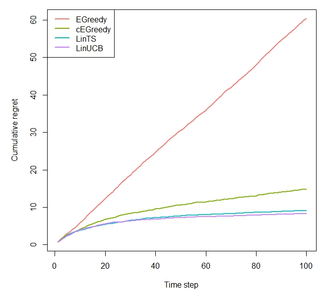

```{r setup, include = FALSE, cache = TRUE}
knitr::opts_chunk$set(
  collapse = TRUE,
  comment = "#>"
)
```

```r
library(contextual)

horizon       <- 100L
simulations   <- 100L

bandit        <- ContextualLinearBandit$new(k = 4, d = 3, sigma = 0.3)

# Linear CMAB policies comparison

agents <- list(Agent$new(EpsilonGreedyPolicy$new(0.1), bandit, "EGreedy"),
               Agent$new(ContextualEpsilonGreedyPolicy$new(0.1), bandit, "cEGreedy"),
               Agent$new(ContextualLinTSPolicy$new(0.1), bandit, "LinTS"),
               Agent$new(LinUCBDisjointOptimizedPolicy$new(0.6), bandit, "LinUCB"))

simulation     <- Simulator$new(agents, horizon, simulations, do_parallel = TRUE)

history        <- simulation$run()

plot(history, type = "cumulative", rate = FALSE, legend_position = "topleft")

```


