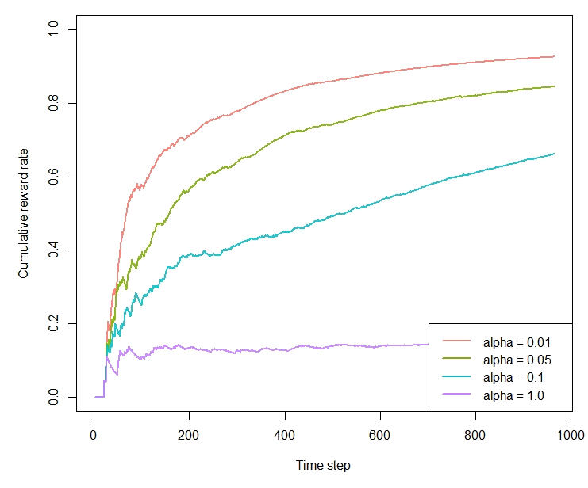

```{r setup, include = FALSE, cache = TRUE}
knitr::opts_chunk$set(
  collapse = TRUE,
  comment = "#>"
)
```

```r
library(contextual)
library(data.table)

# Import personalization data-set

library(contextual); library(data.table)

dt      <- fread("http://pwy.nl/d") # 0/1 reward, 10 arms, 100 features
                                    # arms always start from 1

#      z y x1 x2 x3 x4 x5 x6 x7 x8 x9 x10 x11 x12 x13 x14 x15  .. x100
#   1: 2 0  5  0  0 37  6  0  0  0  0  25   0   0   7   1   0  ..    0
#   2: 8 0  1  3 36  0  0  0  0  0  0   0   0   1   0   0   0  ..   10
#   3: . .  .  .  .  .  .  .  .  .  .   .   .   .   .   .   .  ..    .

horizon     <- nrow(dt)
simulations <- 1

# Set up formula:       y      ~ z    | x1 + x2 + ..
# In bandit parlance:   reward ~ arms | covariates or contextual features

f       <- y ~ z | . - z

# Instantiate Replay Bandit (Li, 2010)
bandit  <- OfflineReplayEvaluatorBandit$new(formula = f, data = dt)

# Bind Policies withs Bandits through Agents, add Agents to list
agents  <- list(Agent$new(LinUCBDisjointOptimizedPolicy$new(0.01), bandit, "alpha = 0.01"),
                Agent$new(LinUCBDisjointOptimizedPolicy$new(0.05), bandit, "alpha = 0.05"),
                Agent$new(LinUCBDisjointOptimizedPolicy$new(0.1),  bandit, "alpha = 0.1"),
                Agent$new(LinUCBDisjointOptimizedPolicy$new(1.0),  bandit, "alpha = 1.0"))

# Instantiate a Simulator
simulation <- Simulator$new(agents, horizon = nrow(dt), simulations = 1)

# Run the simulation.
history    <- simulation$run()

# plot the results
plot(history, type = "cumulative", regret = FALSE, rate = TRUE, 
     legend_position = "bottomright", ylim = c(0,1))
```


