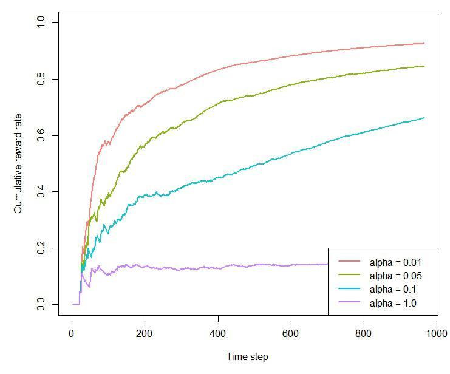

```{r setup, include = FALSE, cache = TRUE}
knitr::opts_chunk$set(
  collapse = TRUE,
  comment = "#>"
)
```

```r
library(contextual)
library(data.table)

# Import personalization data-set

url         <- "http://d1ie9wlkzugsxr.cloudfront.net/data_cmab_basic/dataset.txt"
datafile    <- fread(url)

simulations <- 1
horizon     <- nrow(datafile)

bandit      <- OfflineReplayEvaluatorBandit$new(formula = V2 ~ V1 | . - V1, data = datafile)

# Define agents.
agents      <- list(Agent$new(LinUCBDisjointOptimizedPolicy$new(0.01), bandit, "alpha = 0.01"),
                    Agent$new(LinUCBDisjointOptimizedPolicy$new(0.05), bandit, "alpha = 0.05"),
                    Agent$new(LinUCBDisjointOptimizedPolicy$new(0.1),  bandit, "alpha = 0.1"),
                    Agent$new(LinUCBDisjointOptimizedPolicy$new(1.0),  bandit, "alpha = 1.0"))

# Initialize the simulation.

simulation  <- Simulator$new(agents = agents, simulations = simulations, horizon = horizon,
                             do_parallel = FALSE, save_context = TRUE)

# Run the simulation.
sim  <- simulation$run()

# plot the results
plot(sim, type = "cumulative", regret = FALSE, rate = TRUE, 
          legend_position = "bottomright", ylim = c(0,1))
```


