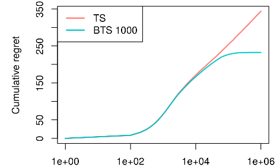

```{r setup, include = FALSE, cache = TRUE}
knitr::opts_chunk$set(
  collapse = TRUE,
  comment = "#>"
)
```

```r
library(contextual)

# Replication of THOMPSON SAMPLING WITH THE ONLINE BOOTSTRAP By Dean Eckles and Maurits Kaptein

# This evaluations takes time - up to a few hours when run single core.

# Running the script in parallel (for example, on 8 cores) 
# shortens the evaluation time substantially.

# https://arxiv.org/abs/1410.4009

# Fig 2. Empirical regret for Thompson sampling and BTS in a K-armed binomial bandit problem.

bandit             <- BasicBernoulliBandit$new(weights = c(0.5, rep(0.4,9)))

agents             <- list(Agent$new(BootstrapTSPolicy$new(1000), bandit, "BTS 1000"),
                           Agent$new(ThompsonSamplingPolicy$new(), bandit, "TS"))

simulator          <- Simulator$new(agents        = agents,
                                    do_parallel   = TRUE,
                                    save_interval = 50,
                                    set_seed      = 999,
                                    horizon       = 1e+05,
                                    simulations   = 1000)

simulator$run()

plot(simulator$history, log = "x")

```


