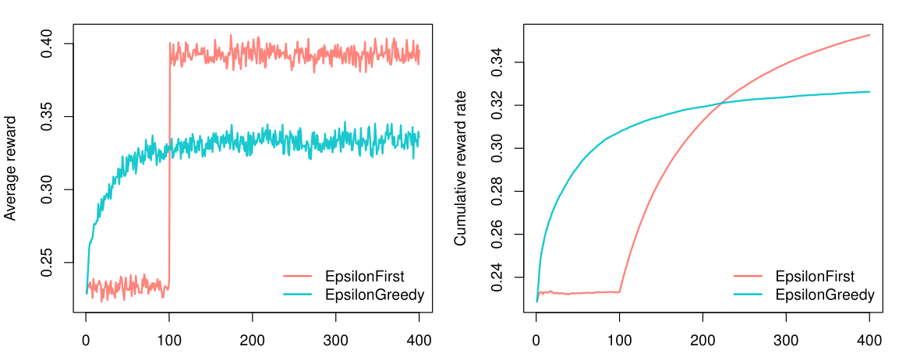
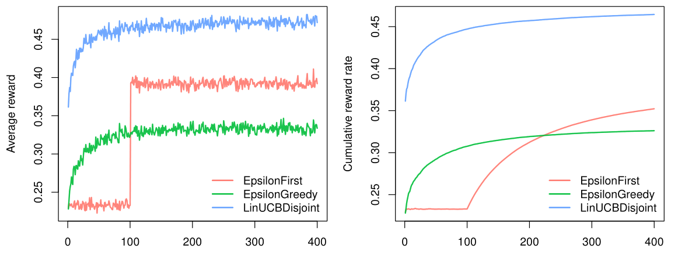

```{r setup, include = FALSE, cache = TRUE}
knitr::opts_chunk$set(
  collapse = TRUE,
  comment = "#>"
)
```

Though contextual has been developed to ease the implementation and comparison of custom Bandits and Policies, it can also be used to evaluate policies from contextual's growing policy library. In the current vignette we will demonstrate how to run such simulations in an online advertising related scenario. Generally, the goal in online advertising is to determine which out of several ads to serve a visitor to a particular web page. Translated to a bandit setting, in online advertising:

* The context is usually determined by visitor and web page characteristics.
* Arms are represented by the pool of available ads.
* An action equals a shown add.
* Rewards are determined by a visitor clicking (a reward of 1) or not clicking (a reward of 0) on the shown ad.

For the current tutorial, we limit the number of advertisements we want to evaluate to three, and set ourselves the objective of finding which policy would offer the highest total click-through rate over four hundred impressions.

#### Evaluating context-free policies

Before we are able to evaluate any policies, we first need to model the three ads---each with a different probability of generating a click---as the arms of a bandit. For the current simulation we choose to model the ads with the weight-based ContextualBernoulliBandit, as this allows us to set weights that determine the average reward probability of each arm. As can be observed in the source code below, for the current simulation, we set the weights of the arms to respectively $\theta_1 = 0.8$, $\theta_2  = 0.4$ and $\theta_3 = 0.2$.

We also choose two context-free policies to evaluate and compare:

* EpsilonFirstPolicy: explores the three ads uniformly at random for a preset period and from thereon exploits the ad with the best click-through rate (a type of policy also known as an A/B test). For the current scenario, we set the exploration period to one hundred impressions.

* EpsilonGreedyPolicy: explores one of the ads uniformly at random $\epsilon$ of the time and exploits the ad with the best current click-through rate $1 - \epsilon$ of the time. Here, we will set $\epsilon = 0.4$. 

Next, we assign the bandit and the two policy instances to two agents. Finally, we assign a list holding both agents to a Simulator instance, set the simulator's horizon to four hundred and the number of repeats to ten thousand, run the simulation, and plot() its results:

```r
# Load and attach the contextual package.
library(contextual)
# Define for how long the simulation will run.
horizon <- 400
# Define how many times to repeat the simulation.
simulations <- 10000
# Define the probability that each ad will be clicked.
click_probabilities <- c(0.8, 0.4, 0.2)
# Initialize a ContextualBernoulliBandit
bandit <- ContextualBernoulliBandit$new(weights = click_probabilities)
# Initialize an EpsilonGreedyPolicy with a 40% exploiration rate.
eg_policy <- EpsilonGreedyPolicy$new(epsilon = 0.4)
# Initialize an EpsilonFirstPolicy with a 100 step exploration period.
ef_policy <- EpsilonFirstPolicy$new(time_steps = 100)
# Initialize two Agents, binding each policy to a bandit.
ef_agent <- Agent$new(ef_policy, bandit)
eg_agent <- Agent$new(eg_policy, bandit)
# Assign both agents to a list.
agents <- list(ef_agent, eg_agent)
# Initialize Simulator with agent list, horizon, and nr of simulations.
simulator <- Simulator$new(agents, horizon, simulations, do_parallel = FALSE)
# Now run the simulator.
history <- simulator$run()
# Finally, plot the average reward per time step t
plot(history, type = "average", regret = FALSE, lwd = 2)
# And the cumulative reward rate, which equals the Click Through Rate)
plot(history, type = "cumulative", regret = FALSE, rate = TRUE, lwd = 2)
```
{width=98%}

As can be observed in the figure above, within our horizon of $T = 400$, EpsilonFirstPolicy has accumulated more rewards than EpsilonGreedytPolicy. It is easy to see why: The winning arm is better than the other two---by a margin. That means that EpsilonFirstPolicy has no difficulty in finding the optimal arm within its exploration period of one hundred impressions. Up to that point, EpsilonGreedyPolicy still had the advantage of a headstart, as it was already able to exploit for $1- \epsilon$ or sixty percent of the time. But from one hundred impressions on, EpsilonFirstPolicy switches from full exploration to full exploitation mode. In contrast to EpsilonGreedyPolicy, it is now able to exploit the arm that proved best during exploration all of the time. As a result, it is able catch up with (and then surpass) the rewards accumulated by EpsilonGreedyPolicy within less than one hundred and fifty impressions.

#### Adding context

If that is all we know of our visitors, we expect the results to be stationary over time, and these are the only policies available, the choice is clear: for this scenario, you would pick EpsilonFirstPolicy (Also: if the bandit model represents our visitors' click behavior realistically, if our policies' parameters are optimal, etcetera). However, if we have contextual information on our visitors---for instance, their age---we might be able to do better. Let us suggest that we expect that some of our ads are more effective for older visitors, and other ads more effective for younger visitors.

To incorporate this expectation in our simulation, we need to change the way our bandit generates its rewards. Fortunately, in the case of ContextualBernoulliBandit, the introduction of two contextual features only requires the addition of a single row to its weight matrix---as ContextualBernoulliBandit parses each of the $d$ rows of its weight matrix as a binary contextual feature, each randomly selected or sampled $1/d$ of the time.


We therefore also include the contextual LinUCBDisjointPolicy, which, in assuming its reward function is a linear function of the context, is able to incorporate our new contextual information into its decision-making process. Now let us rerun the simulation:

```
#                                  +-----+----+-----------> ads: k = 3
#                                  |     |    |
click_probs         <- matrix(c(  0.2,  0.3, 0.1,     # --> d1: old   (p=.5)
                                  0.6,  0.1, 0.1   ), # --> d2: young (p=.5)
                                                      #     features: d = 2

                                  nrow = 2, ncol = 3, byrow = TRUE)

# Initialize a ContextualBernoulliBandit with contextual weights
context_bandit      <- ContextualBernoulliBandit$new(weights = click_probs)
# Initialize LinUCBDisjointPolicy
lucb_policy         <- LinUCBDisjointPolicy$new(0.6)
# Initialize three Agents, binding each policy to a bandit.
ef_agent            <- Agent$new(ef_policy, context_bandit)
eg_agent            <- Agent$new(eg_policy, context_bandit)
lucb_agent          <- Agent$new(lucb_policy, context_bandit)
# Assign all agents to a list.
agents              <- list(ef_agent, eg_agent, lucb_agent)
# Initialize Simulator with agent list, horizon, and nr of simulations.
simulator           <- Simulator$new(agents, horizon, simulations, do_parallel = FALSE)
# Now run the simulator.
history             <- simulator$run()
# And plot the cumulative reward rate again.
plot(history, type = "cumulative", regret = FALSE, rate = TRUE)
```
{width=98%}

As can be observed in the figure above, both context-free bandit's do indeed not do better than before. On the other hand, LinUCBDisjointPolicy does very well, as it is able to map its rewards to the available contextual features. 

Of course, the simulations in the current vignette are not very realistic. One way to ameliorate this would be to write a Bandit subclass with a more complex generative model. More on that in the vignette "Creating your own Policies and Bandits". Another option would be to evaluate policies on offline datasets. Which is covered in the vignette "Evaluating policies with offline datasets".


