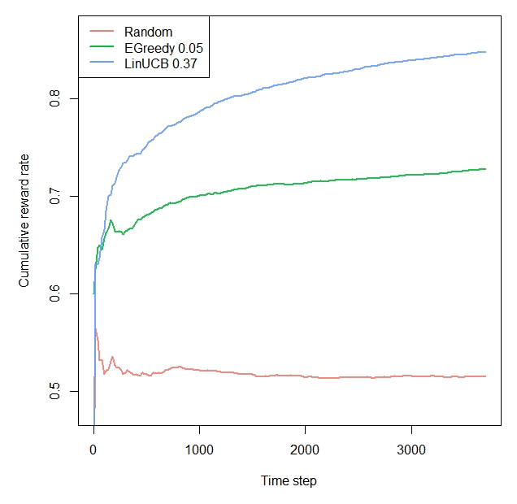

```{r setup, include = FALSE, cache = TRUE}
knitr::opts_chunk$set(
  collapse = TRUE,
  comment = "#>"
)
```

```r
library(contextual)
library(data.table)

# Import personalization data-set

# Info: https://d1ie9wlkzugsxr.cloudfront.net/data_irecsys_CARSKit/Movie_DePaulMovie/README.txt

url         <- "http://d1ie9wlkzugsxr.cloudfront.net/data_irecsys_CARSKit/Movie_DePaulMovie/ratings.csv"
data        <- fread(url, stringsAsFactors=TRUE)

# Convert data

data        <- contextual::one_hot(data, cols = c("Time","Location","Companion"), sparsifyNAs = TRUE)
data[, itemid := as.numeric(itemid)]
data[, rating := ifelse(rating <= 3, 0, 1)]

# Set simulation parameters.
simulations <- 10  # here, "simulations" represents the number of boostrap samples
horizon     <- nrow(data)

# Initiate Replay bandit with 10 arms and 100 context dimensions
# Arms always start with 1 for the first arm
log_S       <- data
formula     <- formula("rating ~ itemid | Time_Weekday + Time_Weekend + Location_Cinema + 
                                          Location_Home + Companion_Alone + Companion_Family + 
                                          Companion_Partner")
bandit      <- OfflineBootstrappedReplayBandit$new(formula = formula, data = data)

# Define agents.
agents      <-
  list(Agent$new(RandomPolicy$new(), bandit, "Random"),
       Agent$new(EpsilonGreedyPolicy$new(0.03), bandit, "EGreedy 0.05"),
       Agent$new(ThompsonSamplingPolicy$new(), bandit, "ThompsonSampling"),
       Agent$new(LinUCBDisjointOptimizedPolicy$new(0.37), bandit, "LinUCB 0.37"))

# Initialize the simulation.
simulation  <-
  Simulator$new(
    agents           = agents,
    simulations      = simulations,
    horizon          = horizon
  )

# Run the simulation.
# Takes +- 5 minutes: bootstrapbandit loops through arms x horizon x simulations (times nr of agents).
sim  <- simulation$run()

# plot the results
plot(sim, type = "cumulative", regret = FALSE, rate = TRUE,
         legend_position = "topleft", ylim=c(0.48,0.87))

```


