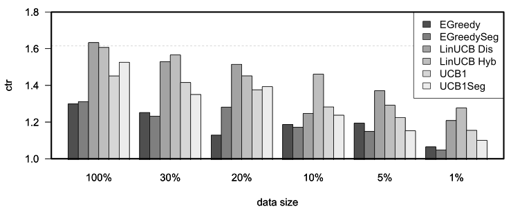
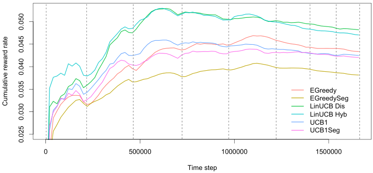

```{r setup, include = FALSE, cache = TRUE}
knitr::opts_chunk$set(
  collapse = TRUE,
  comment = "#>"
)
```

In the current vignette, we demonstrate how `contextual` facilitates the comparison of bandit policies on big offline datasets by running a partial replication of "[A Contextual-Bandit Approach to Personalized News Article Recommendation](https://arxiv.org/abs/1003.0146)" by Li et al 2010. This paper describes how the authors made use of offline Yahoo! click-through rate data to evaluate and compare the effectiveness of several context-free and contextual policies.

All source code related to this replication can be found in the package's `demo/replication_li_2010` directory.

#### Description of the data

The dataset used in the Li et al 2010 paper has been made available at the Yahoo! lab's website (At https://webscope.sandbox.yahoo.com/catalog.php?datatype=r&did=49). It contains the click-through rate from the Today news module on Yahoo!'s homepage over the course of several days in May 2009, totaling 45,811,883 separate events.

Each row in the dataset describes an interaction event (click or no click) of users shown a randomly chosen article. Each of these events contains the following information:

* The ID's of each of a varying subset of 19 to 25 articles selected by human editors from a pool of 217 articles.
* The ID of an article randomly chosen from the subset defined in 1. and positioned at the story position (that is, at the top of the Yahoo!'s website's "Today" segment).
* Six features per article for each of the articles shown.
* Six user features (with a distinct user for each event).
* Whether or not a user clicked on the article at the story position.

That is, for each event $t$ an article represents one of $A$ actions (that is, one of the 271 articles observed within the course of the 10 days covered by the dataset) with $\mathbb{R}^6$ features $X_{t,a}$ per arm, and another $\mathbb{R}^6$ features $X_{t,u}$ per unique visitor. Together, the flattened outer product of the user and article feature vector creates a $\mathbb{R}^{36}$ feature vector $X_t$ for each user and article pair with outcome value or reward $r_t$ click (1) or no click (0). For the further details on the data structure and the general setup of the experiment, we refer the reader to the original Li et al 2010 paper.

#### Data import

As the Yahoo data is too large to fit into memory, we imported the dataset's CSV files into a `MonetDB` instance---a fast, open source column-oriented database management system with excellent R support (MonetDB can be downloaded at https://www.monetdb.org/). The import script, example import scripts for several other databases (`MySQL`, `SQLite`, `Postgresql`) and all other source code related to this replication can be found in the package's `demo/replication_li_2010` directory.

#### Custom bandit and policies

With the Yahoo! data imported into the MonetDB server, the next step was to create a custom offline `YahooBandit` plus seven `Policy` subclasses implementing the policies described in the Li et al 2010 paper. Though most of these policies were already implemented in `contextual`, the fact that only a subset of all 271 articles or arms are shown to a visitor at a time meant we needed to make some minor changes to `contextual`'s exisiting classes to make the policies run smoothly on a continually shifting pool of active arms.

To facilitate these shifting arms, `YahooBandit` makes use of an `self$arm_lookup` table listing all 271 arms. This table enables the bandit to look up the currently active arms' indexes from the shifting set of article ID's as specified in the dataset for each time step $t$, and return these indexes to the policies under evaluation:

```r
    get_context = function(index) {
      ...
      # Retrieve the index of all arms this row/event.
      arm_indices_this_event  <- seq(10, 184, by = 7)
      article_ids             <- row[arm_indices_this_event]
      article_ids             <- article_ids[!is.na(article_ids)]
      article_ids             <- match(article_ids,self$arm_lookup)
      ...
      context <- list(
        k = self$k,
        d = self$d,
        unique = self$unique, # Indexes of disjoint arms (user features)
        shared = self$shared, # Indexes of shared arms (article features)
        arms = article_ids,   # Indexes of arms this event.
        X = X
      )
    }
```

The policy classes then use this information to select and update only the currently active subset of arms. For instance, in `YahooEpsilonGreedyPolicy`'s `get_action()`:

```r
    get_action = function(t, context) {
      if (runif(1) > self$epsilon) {
        # get the max of context$arms *currently in play*
        max_index          <- context$arms[max_in(theta$mean[context$arms])]
        self$action$choice <- max_index
      } else {
        # sample from the arms *currently in play*
        self$action$choice <- sample(context$arms, 1)
      }
      self$action
    }
```

On completing the implementation of the aforementioned seven custom policy subclasses (`Random`, `EGreedy`, `EGreedySeg`, `LinUCBDis`, `LinUCBHyb`, `UCB1` and `UCB1Seg`) we then assigned them to six simulations---one for each of the six (0, 30, 20, 10, 5 and 1 percent) levels of sparsity  defined in the original paper. This resulted in $7\times6=42$ Agents, which were then run on the offline dataset as follows:

```r
simulations             <- 1
horizon                 <- 37.45e6
...
con <- DBI::dbConnect(MonetDB.R(), host=monetdb_host, dbname=monetdb_dbname,
                                   user=monetdb_user, password=monetdb_pass)

message(paste0("MonetDB: connection to '",dbListTables(con),"' succesful!"))

arm_lookup_table <-
  as.matrix(DBI::dbGetQuery(con, "SELECT DISTINCT article_id FROM yahoo"))

arm_lookup_table <- rev(as.vector(arm_lookup_table))

bandit <- YahooBandit$new(k = 217L, unique = c(1:6), shared = c(7:12),
                          arm_lookup = arm_lookup_table, host = monetdb_host,
                          dbname = monetdb_dbname, user = monetdb_user,
                          password = monetdb_pass, buffer_size = buffer_size)

agents <-
  list (Agent$new(YahooLinUCBDisjointPolicy$new(0.2),
                  bandit, name = "LinUCB Dis",  sparse = 0.99),
        Agent$new(YahooLinUCBHybridPolicy$new(0.2),
                  bandit, name = "LinUCB Hyb",  sparse = 0.99),
        Agent$new(YahooEpsilonGreedyPolicy$new(0.3),
                  bandit, name = "EGreedy",     sparse = 0.99),
        Agent$new(YahooEpsilonGreedySegPolicy$new(0.3),
                  bandit, name = "EGreedySeg",  sparse = 0.99),
        Agent$new(YahooUCB1AlphaPolicy$new(0.4),
                  bandit, name = "UCB1",        sparse = 0.99),
        Agent$new(YahooUCB1AlphaSegPolicy$new(0.4),
                  bandit, name = "UCB1Seg",     sparse = 0.99),
        ...
        Agent$new(YahooRandomPolicy$new(),
                  bandit, name = "Random"))

simulation <- Simulator$new(
    agents,
    simulations = simulations,
    horizon = horizon,
    do_parallel = TRUE,
    worker_max = worker_max,
    reindex = TRUE,
    progress_file = TRUE,
    include_packages = c("MonetDB.R"))

history  <- simulation$run()
...
```

#### Results

We were able to complete the full $7\times6=42$ agent simulation over all of the 37,450,196 events in our database within 22 hours on a 64 core Intel Xeon Unbuntu server with 256GB of memory. We then proceeded to analyse the results of the first 4.7 million events (following the original paper, representing about a day worth of events) to reproduce Li et al 2010's Figure 4b: "CTRs in evaluation data with varying data sizes in the learning bucket.". Just like the original paper, the replicated figure below reports each algorithm's relative CTR for all of the defined data sparsity levels, that is, each algorithm's CTR divided by the random policy's CTR.


{width=98%}

*Replication of Figure 4b "CTRs in evaluation data with varying data sizes in the learning bucket." from Li et al 2010. The plots represent the click through rates for different policies after one day of learning for each of six different levels of sparsity.*

As can be observed in the next figure, after one day of learning (on the Yahoo! dataset's day three), the conclusions of the original paper still stand. First, features again prove to be of use at all levels of sparsity, as LinUCB policies outperform the others consistently. Second, UCB policies generally outperform $\epsilon$-greedy ones. And third, Hybrid LinUCB shows benefits when the data is small, as it does even better relative to Disjoint LinuCB in the 1% bucket. 

To explore a little further, we also run a simulation that continued to learn beyond the first day for the sparse (1%) data condition to test---for the results, see the final figure.

{width=98%}

*A plot of the cumulative reward rate (equals click-through rate) for EGreedy, EGreedySeg, LinUCB Dis, LinUCB Hyb, UCB1, and UCB1Seg policies over eight days of events from the Yahoo dataset at 1% sparsity. The dotted lines represent blocks consisting of 24 hours worth of data---the lines are not equidistant as the number of data points of these 24 hours differs per block. The plot's sinusoidal wave pattern reflects visitors' overall average cyclical daily waxing and waning click-through tendency.*

