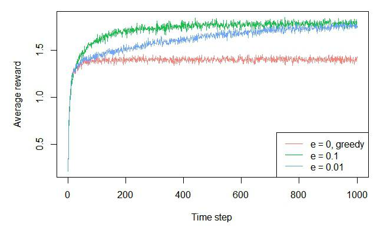
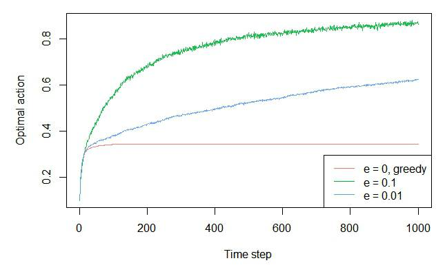
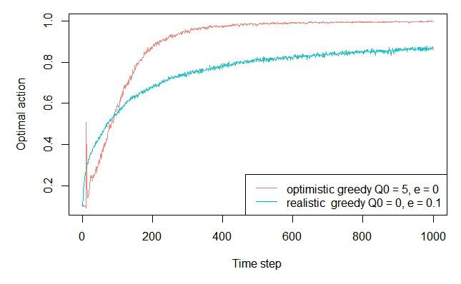
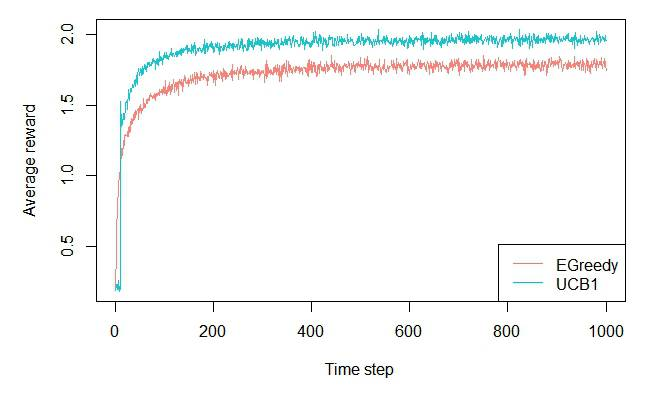
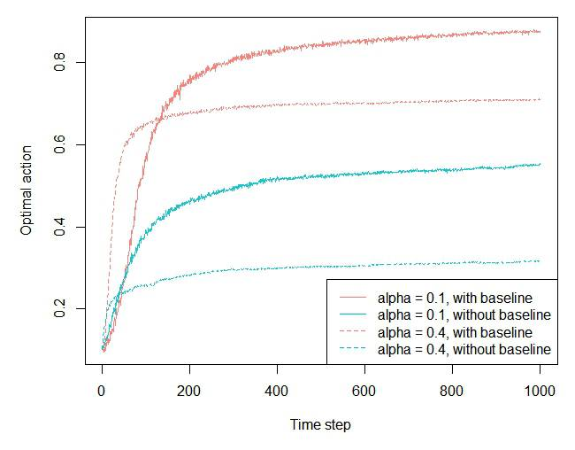

```{r setup, include = FALSE, cache = TRUE}
knitr::opts_chunk$set(
  fig.pos = 'H',
  collapse = TRUE,
  comment = "#>"
)
```

Simulation of the multi-armed Bandit examples in chapter 2 of "Reinforcement Learning: An Introduction" by Sutton and Barto, 2nd ed. (Version: 2018)

This book is available here: [Sutton&Barto](http://incompleteideas.net/book/the-book-2nd.html)

# 2.3 The 10-armed Testbed

Generate the 10 arms.

```r

library(contextual)

set.seed(2)
mus             <- rnorm(10, 0, 1)
sigmas          <- rep(1, 10)
bandit          <- BasicGaussianBandit$new(mu_per_arm = mus, sigma_per_arm = sigmas)

```

## The violin plot

Install ggplot2 and ggnormalviolin libraries to be able to generate Figure 2.1.


```r

if(!require(ggplot2)) install.packages("ggplot2")
if(!require(ggnormalviolin)) devtools::install_github("wjschne/ggnormalviolin")

library(ggplot2)
library(ggnormalviolin)

print(ggplot(data = data.frame(dist_mean = mus, dist_sd = sigmas, dist = factor((1:10))), 
             aes(x = dist, mu = dist_mean, sigma = dist_sd)) + ylab("Reward distribution") +
             geom_normalviolin() + theme(legend.position = "none") + 
             xlab("Action") + geom_hline(aes(yintercept = 0)))

```


## The epsilon greedy plot 

```r

agents          <- list(Agent$new(EpsilonGreedyPolicy$new(0),    bandit, "e = 0, greedy"),
                        Agent$new(EpsilonGreedyPolicy$new(0.1),  bandit, "e = 0.1"),
                        Agent$new(EpsilonGreedyPolicy$new(0.01), bandit, "e = 0.01"))

simulator       <- Simulator$new(agents = agents, horizon = 1000, simulations = 2000)
history         <- simulator$run()

plot(history, type = "average", regret = FALSE, lwd = 1, legend_position = "bottomright")
plot(history, type = "optimal", lwd = 1, legend_position = "bottomright")

```





# 2.6 - Optimistic values 

```r

agents  <- list(Agent$new(EpsilonGreedyPolicy$new(0), bandit, 
                          "optimistic greedy Q0 = 5, e = 0"),
                          
                Agent$new(EpsilonGreedyPolicy$new(0.1), bandit, 
                          "realistic  greedy Q0 = 0, e = 0.1"))

agents[[1]]$policy$theta$mean <- as.list(rep(5,10))
agents[[1]]$policy$theta$n    <- as.list(rep(5,10))

simulator       <- Simulator$new(agents = agents, horizon = 1000, simulations = 2000)
history         <- simulator$run()

plot(history, type = "optimal", lwd = 1, legend_position = "bottomright")

```



# 2.7 - Upper-Confidence-Bound Action Selection 

```r

agents          <- list(Agent$new(EpsilonGreedyPolicy$new(0.1),  bandit, "EGreedy"),
                        Agent$new(UCB1Policy$new(),   bandit,            "UCB1"))

simulator       <- Simulator$new(agents = agents, horizon = 1000, simulations = 2000)
history         <- simulator$run()

plot(history, type = "average", regret = FALSE, lwd = 1, legend_position = "bottomright")

```



# 2.8 - Gradient Bandit Algorithms 

```r
set.seed(2)
mus             <- rnorm(10, 0, 1)
sigmas          <- rep(1, 10)
bandit          <- BasicGaussianBandit$new(mu_per_arm = mus, sigma_per_arm = sigmas,
                                           mu_offset = 4)

agents          <- list(Agent$new(GradientPolicy$new(0.1, TRUE),  bandit,
                                  "alpha = 0.1, with baseline"),
                        Agent$new(GradientPolicy$new(0.1, FALSE), bandit,
                                  "alpha = 0.1, without baseline"),
                        Agent$new(GradientPolicy$new(0.4, TRUE),  bandit,
                                  "alpha = 0.4, with baseline"),
                        Agent$new(GradientPolicy$new(0.4, FALSE), bandit,
                                  "alpha = 0.4, without baseline"))

simulator       <- Simulator$new(agents = agents, horizon = 1000, simulations = 2000)
history         <- simulator$run()

plot(history, type = "optimal", lwd = 1, legend_position = "bottomright",
     color_step = 2, lty_step = 2)
```

