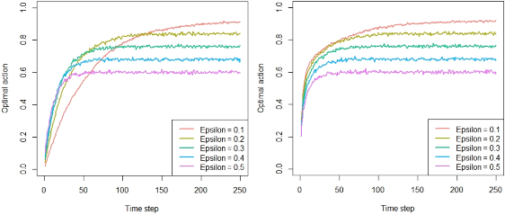
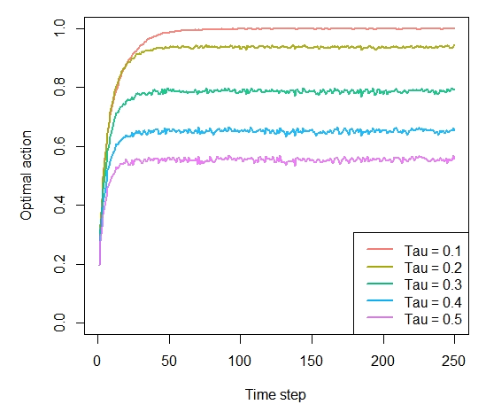
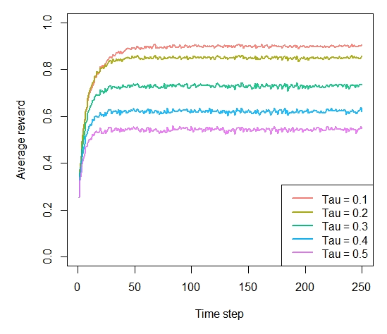
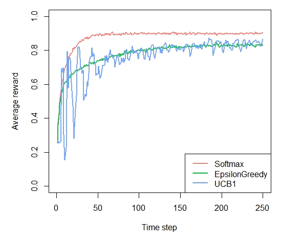

```{r setup, include = FALSE, cache = TRUE}
knitr::opts_chunk$set(
  fig.pos = 'H',
  collapse = TRUE,
  comment = "#>"
)
```

Simulation of multi-armed Bandit policies following John Myles White's "Bandit algorithms for website_optimization".

The book, which offers a great entry-level introduction to context-free bandit policies, is available here: [John Myles White](http://shop.oreilly.com/product/0636920027393.do). The orignal (Python) code for the book can be found in its complementary [GitHub repository](https://github.com/johnmyleswhite/BanditsBook).

## Discrepancies with the book

The [code used to generate the plots](https://github.com/johnmyleswhite/BanditsBook) in the book always chooses the first arm (in other words, the arm with the lowest index) when rewards between arms are tied. In the original Python code:
```
def ind_max(x):
  m = max(x)
  return x.index(m)
```
This introduces a bias that adds up over time, changing simulations' results and plots. In R, (which uses 1 based indexing) this corresponds to always doing:
```r
rewards      <- c(0,0,1,0,1)
max_reward   <-which.max(rewards)
max_reward   # always contains lowest index, 3 in this case, biasing results
```
Contextual correctly returns the index of one of the tied maxima random, fixing the bias, resulting in slightly different plots. In Python, a patch along the following lines would resolve this issue:
```
def ind_max(x):
  max_value = max(rewards)
  max_keys = [k for k, v in enumerate(rewards) if v == max_value]
  return random.choice(max_keys)
```
In R, this corresponds to, for example:
```r
rewards      <- c(0,0,1,0,1)
max_reward   <- which(rewards == max(rewards))
if(length(max_reward) > 1){
  max_reward <- sample(max_reward, 1)
}
max_reward   # randomly assigned either 3 or 5, no bias
```

To illustrate, a replication of the original Figure 4-3 when running a simulation with the biased arm selection, (as used in the book) on the left, contextual's unbiased simulation to the right:



## Chapter 4 - Debugging and epsilon greedy

```r
prob_per_arm       <- c(0.1, 0.1, 0.1, 0.1, 0.9)
horizon            <- 250
simulations        <- 5000

bandit             <- BasicBernoulliBandit$new(prob_per_arm)

agents             <- list(Agent$new(EpsilonGreedyPolicy$new(0.1), bandit, "Epsilon = 0.1"),
                           Agent$new(EpsilonGreedyPolicy$new(0.2), bandit, "Epsilon = 0.2"),
                           Agent$new(EpsilonGreedyPolicy$new(0.3), bandit, "Epsilon = 0.3"),
                           Agent$new(EpsilonGreedyPolicy$new(0.4), bandit, "Epsilon = 0.4"),
                           Agent$new(EpsilonGreedyPolicy$new(0.5), bandit, "Epsilon = 0.5"))

simulation         <- Simulator$new(agents, horizon, simulations)
history            <- simulation$run()

```

### Figure 4-2. How often does the epsilon greedy algorithm select the best arm?

```r
plot(history, type = "optimal", legend_position = "bottomright", ylim = c(0,1))
```


### Figure 4-3. How much reward does the epsilon greedy algorithm earn on average?

```r
plot(history, type = "average", regret = FALSE, legend_position = "bottomright", ylim = c(0,1))
```


### Figure 4-4. How much reward has the epsilon greedy algorithm earned by trial t?

```r
plot(history, type = "cumulative", regret = FALSE)
```


## Chapter 5 - Softmax

```r
agents             <- list(Agent$new(SoftmaxPolicy$new(0.1), bandit, "Tau = 0.1"),
                           Agent$new(SoftmaxPolicy$new(0.2), bandit, "Tau = 0.2"),
                           Agent$new(SoftmaxPolicy$new(0.3), bandit, "Tau = 0.3"),
                           Agent$new(SoftmaxPolicy$new(0.4), bandit, "Tau = 0.4"),
                           Agent$new(SoftmaxPolicy$new(0.5), bandit, "Tau = 0.5"))

simulation         <- Simulator$new(agents, horizon, simulations)
history            <- simulation$run()
```

### Figure 5-2. How often does the softmax algorithm select the best arm?

```r
plot(history, type = "optimal", legend_position = "bottomright", ylim = c(0,1))
```


### Figure 5-3. How much reward does the softmax algorithm earn on average?

```r
plot(history, type = "average", regret = FALSE, legend_position = "bottomright", ylim = c(0,1))
```


### Figure 5-4. How much reward has the softmax algorithm earned by trial t?

```r
plot(history, type = "cumulative", regret = FALSE)
```


## Chapter 6 - UCB

```r
agents             <- list(Agent$new(SoftmaxPolicy$new(0.1), bandit, "Softmax"),
                           Agent$new(EpsilonGreedyPolicy$new(0.1), bandit, "EpsilonGreedy"),
                           Agent$new(UCB1Policy$new(), bandit, "UCB1"))

simulation         <- Simulator$new(agents, horizon, simulations)
history            <- simulation$run()
```

### Figure 6-3. How often does the UCB algorithm select the best arm?

```r
plot(history, type = "optimal", legend_position = "bottomright", ylim = c(0,1))
```


### Figure 6-4. How much reward does the UCB algorithm earn on average?

```r
plot(history, type = "average", regret = FALSE, legend_position = "bottomright", ylim = c(0,1))
```


### Figure 6-5. How much reward has the UCB algorithm earned by trial t?

```r
plot(history, type = "cumulative", regret = FALSE)
```


